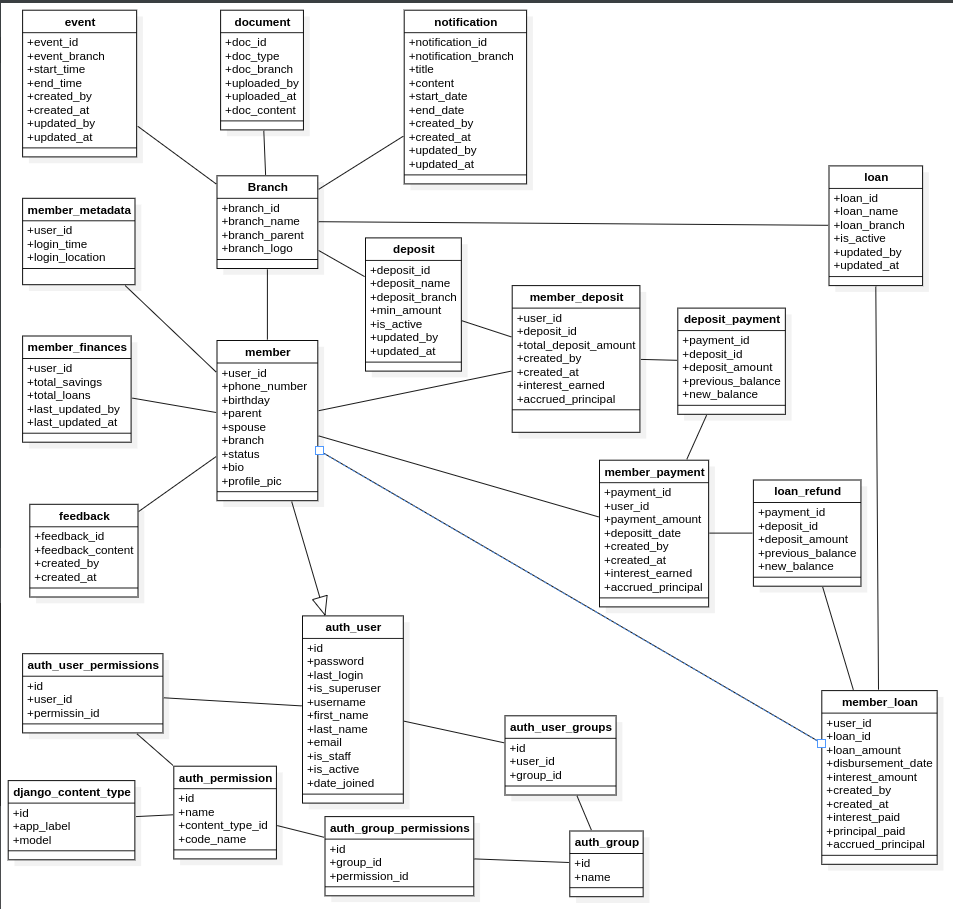

<h1 style="text-align: center"> Meeting management </h1>

<h1> High Level User Stories </h1>
<h2>Community Module</h2>

- As a Member, I want to:
    - Log in securely so I can access the app's features.
    - View a list of other community members so I can connect with them.
    - See general announcements so I'm aware of important community news.
    - Receive and view specific messages sent directly to me so I don't miss personal communications.
    - Update my profile information (e.g., name, contact details) so others can identify me and reach out.
    - Search for other members so I can easily find specific individuals.

- As an Admin, I want to:
    - Log in securely so I can access admin functionalities.
    - Create, edit, and delete general announcements so I can communicate important information to all members.
    - Manage user accounts (e.g., add new members, deactivate accounts) so I can maintain the member directory.
    - Assign or revoke admin roles to other users so I can delegate responsibilities.

<h2> Finance Module </h2>

- As a Member, I want to:
    - View my current savings balance so I can track my contributions.
    - View my current loan balance so I can track my outstanding debt.
    - See the interest I have earned on my savings so I understand the growth of my funds.
    - See the interest I owe on my loans so I know my total repayment amount.
    - View a history of my savings transactions so I can review my deposits.
    - View a history of my loan transactions and repayments so I can track my loan progress.
    - Request a new loan so I can apply for financial assistance.
    - Make a savings deposit so I can add funds to my account.
    - Make a loan repayment so I can pay back my debt.

- As a Financial Admin, I want to:
    - Log in securely to the finance module so I can manage financial operations.
    - View all members' savings balances and transaction histories so I have a complete overview of community savings.
    - View all members' loan balances and repayment histories so I have a complete overview of outstanding loans.
    - Approve or reject loan requests so I can manage the loan application process.
    - Configure interest rates for savings so I can set the return on member deposits.
    - Configure interest rates for loans so I can set the cost of borrowing.
    - Define and configure interest accrual periods (e.g., monthly, quarterly) so interest is calculated consistently.
    - Define and configure interest accrual methods (e.g., simple, compound) so I can control how interest is applied.
    - Record savings deposits for any member so I can manage member accounts.
    - Record loan disbursements and repayments for any member so I can manage loan accounts.
    - Generate financial reports (e.g., total savings, total loans, interest accrued) so I can analyze the community's financial health.
    - Assign or revoke financial admin roles to other users.

    <h1> MVP Features </h1>

## CORE AUTHENTICATION & SECURITY		
### Basic Authentication		
- Secure login/logout functionality		
- Password reset and recovery		
- Session management and timeout		
- Two-factor authentication (2FA)		
- Account lockout after failed attempts		
### Advanced Security		
- Role-based access control (RBAC)		
- Audit logging for all user actions		
- Data encryption at rest and in transit		
- Single Sign-On (SSO) integration (Google Preferably)		
- Biometric authentication support		
- IP whitelisting/blacklisting		
## COMMUNITY MODULE		
### Member Management		
- User profile creation and management		
- Profile picture upload and management		
- Contact information management		
- Member directory with search and filtering		
- Advanced search with multiple criteria		
- Member status indicators (online/offline)		
### Communication Features		
- General announcements system		
- Push notifications for messages		
- Email notifications integration		
### Community Features		
- Community calendar/events		
- Document sharing library		
- Photo/video galleries		
- Member rating/feedback system		
### Administrative Functions		
- User account management (create, edit, deactivate)		
- Role assignment and management		
- Bulk user operations		
## FINANCE MODULE		
### Basic Financial Operations		
- Savings account management		
- Loan account management		
- Transaction recording and tracking		
- Balance inquiries and statements		
- Transaction categorization		
### Savings Management		
- Deposit recording and tracking		
- Savings history and statements		
### Loan Management		
- Loan application system		

    <h1> Technical Implementation </h1>

**Backend:** Python (Django)
- **Frontend:** Flutter
- **ERD:** 
- **db:** PostGres
- **Authentication:** OAuth

- **host:** ?

> admin

    - admin@ak.app
    - AK.principal
